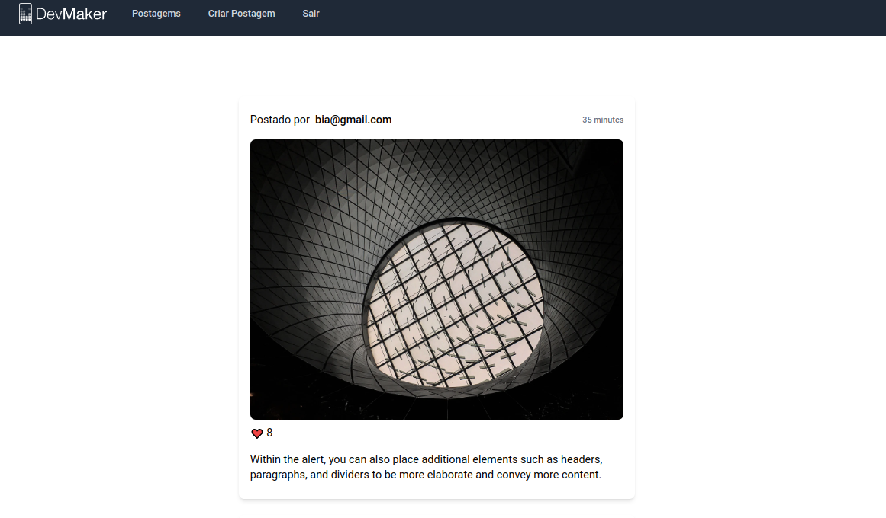

# LameBook - Rede Social



LameBook, projeto beta de uma rede social, inicialmente com as seguintes funcionalidades:

* Cadastrar usuário
* Realizar Login
* Realizar Logout
* Exibe todas as postagem feitas apenas por usuários cadastrados
* Cadastrar nova postagem

Observação: Apesar de conter imagem na postagem, a versão atual ainda não contempla essa funcionalidade, foi adicionada imagem fixa apenas para fins visuais.

## Tecnologias Usadas

* Ruby 3.2.0

* Rails 7.0.4

* PostgreSQL

* Docker

## Passos de como rodar

* Clone o projeto

```
  git clone git@github.com:phpricardo/lamebook.git
```
* Entre na pasta <strong>lamebook</strong> e rode os seguintes comandos:

> docker-compose build

> docker-compose run --rm web rails db:create db:migrate

> docker-compose up

* Por fim se tudo tiver dado certo e nada errado :D , o projeto estará rodando em http://localhost:3000
